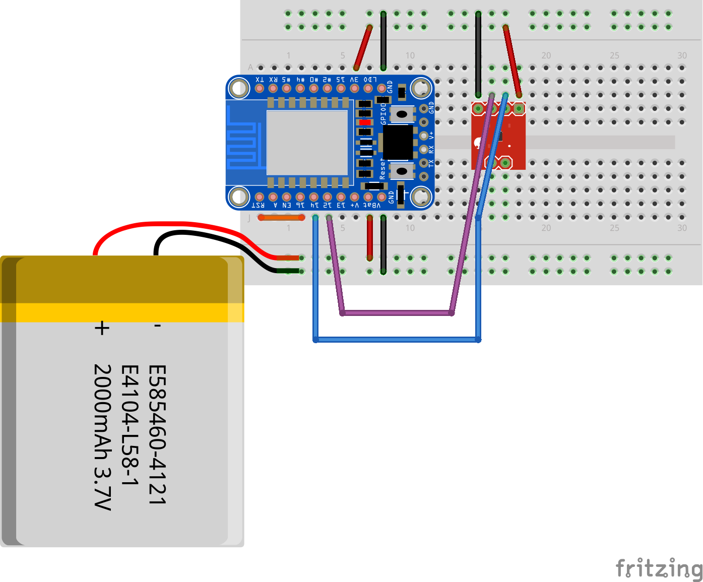

# ESP8266-TMP102

Cribbed from :
More about the effort, and the nuances of prototyping with inexpensive ESP8266 modules can be found on my
blog: https://austinlightguy.wordpress.com/2015/04/28/esp8266-update/

Please note that according to this thread: http://www.esp8266.com/viewtopic.php?f=32&t=6763 You need pull-up on both GPIO 0 and 2 pins (Vcc --->4.7K --> GPIO2, Vcc --> 4.7K -->GPIO0). What happens is sometimes deep wake-up causes ESP hang so we need to pull-up on pins. - See more at: http://www.esp8266.com/viewtopic.php?f=32&t=6763#sthash.bKspk7bU.dpuf

Converted to send Temperature over HTTP request / WiFi:

    192.168.1.134 - - [05/Nov/2015:01:45:17 +0000] "GET /checkin/18:fe:34:f4:d2:
77/temperature/13.8125/ HTTP/1.1" 200 636 "-" "-"

One more thing - LUA is integer-based and this can cause problems with conversio
n to Centigrade. 
I had to download and flash a floating-point-capable firmware image (nodemcu_flo
at_*.bin) 
from https://github.com/nodemcu/nodemcu-firmware/releases.

